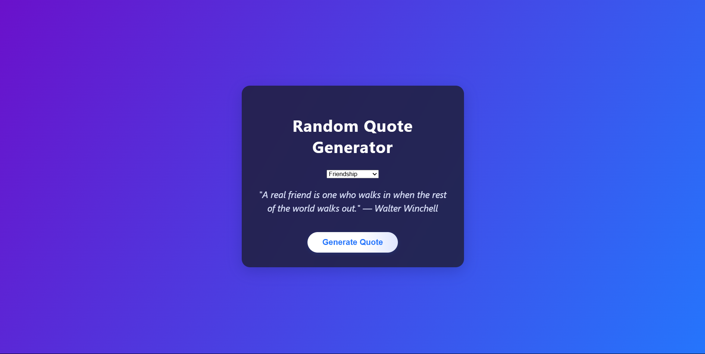

# 🎯 Quote Generator

A simple and elegant quote generator web app that displays random quotes to inspire and motivate users. Built using HTML, CSS, and JavaScript.

 <!-- Replace with actual path if needed -->

---

## 🚀 Live Demo

🔗 [View the Live Site](https://harshitabisht05.github.io/quote-generator/)

---

## 🛠️ Features

- 🎲 Displays a new quote with each button click
- 🌐 Responsive design for mobile and desktop
- 🎨 Simple and clean UI
- ⚡ Fast and lightweight

---

## 📁 Folder Structure
```
quote-generator/
├── index.html
├── style.css
├── script.js
├── .gitignore
├── package.json
└── README.md
```

> 📌 *Make sure `index.html` is in the root for GitHub Pages to work properly.*

---

## 🧑‍💻 Tech Stack

- HTML5
- CSS3
- JavaScript

---

## 📦 Setup Instructions

```bash
# Clone the repo
git clone https://github.com/harshitabisht05/quote-generator.git

# Move to project directory
cd quote-generator

# If using local server (optional)
npx live-server public/
```

## 🙋‍♀️ Author
👩‍💻 [Harshita Bisht](www.linkedin.com/in/harshitabisht0511)

Feel free to ⭐ the repo if you like it!
